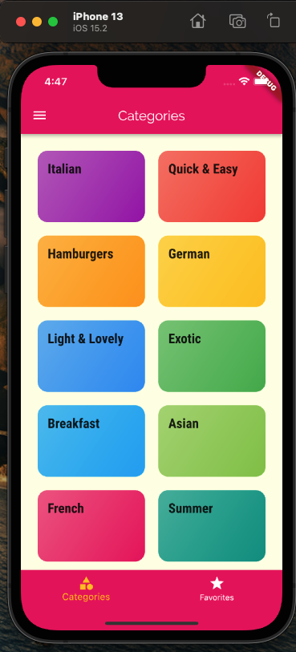
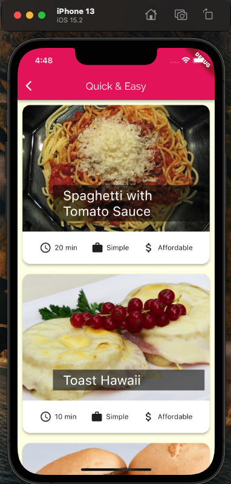
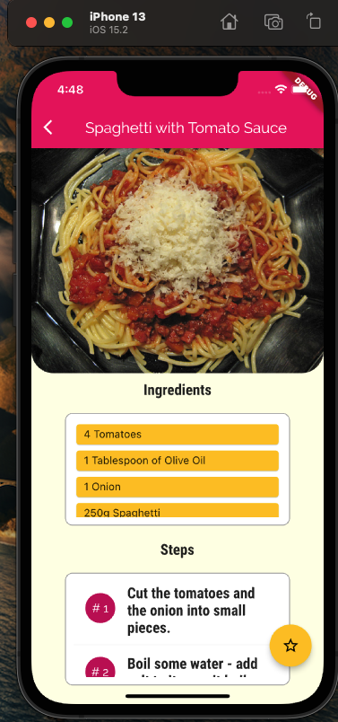
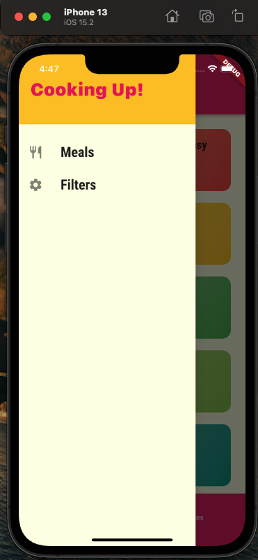
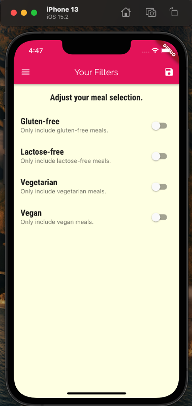
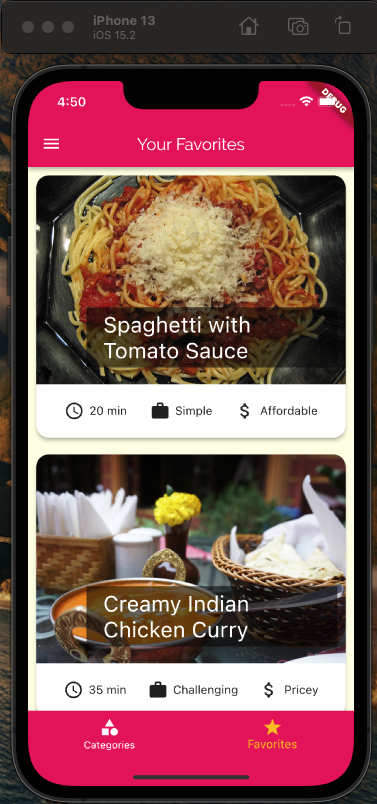
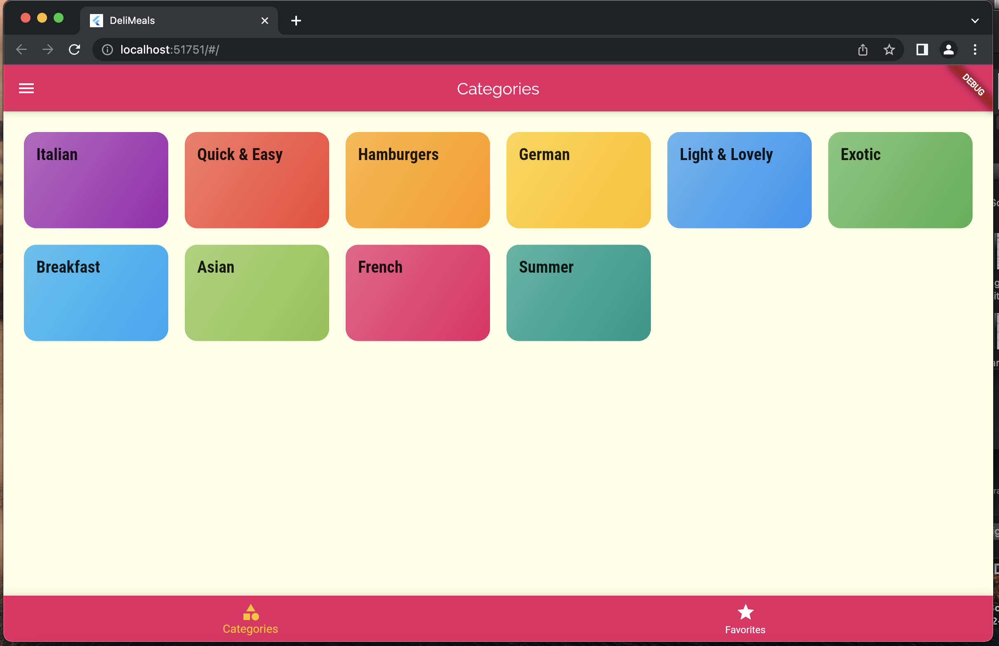

# mealapp

Meal App project consist of a flutter app where user can view recipes of meals in different categories, filter or favorite them according to their desires.

##Screenshots of the app can be seen below.

*Main page*

*Inside of a category page*

*Meal Detail Page*

*Drawer*

*Filters Page*

*Favorites page*

*Look on the web build*

