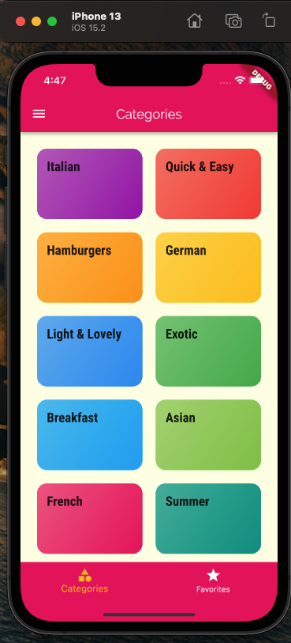
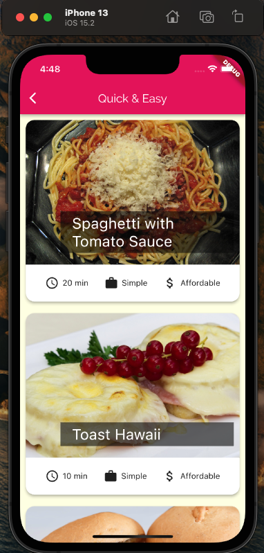
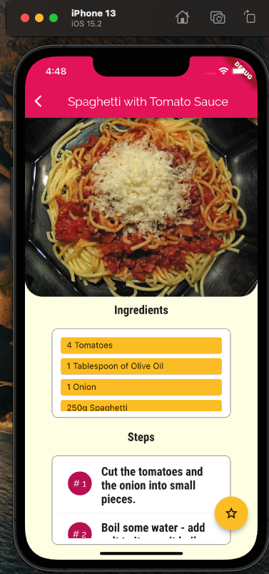
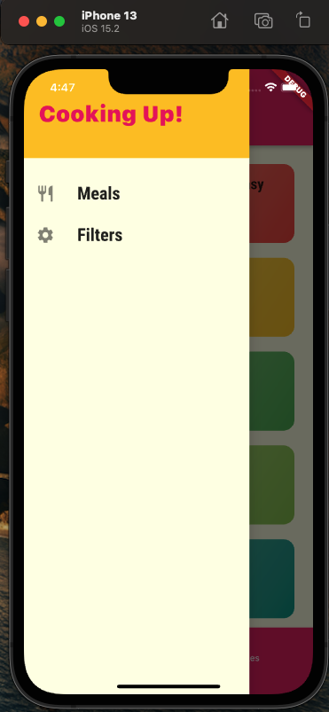
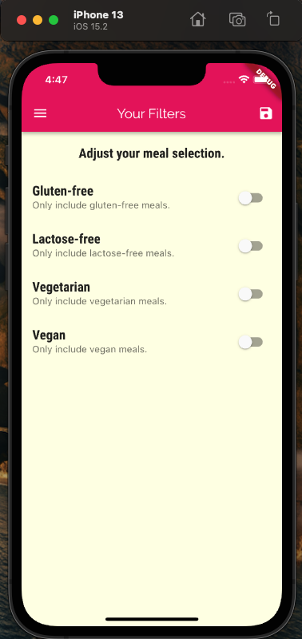
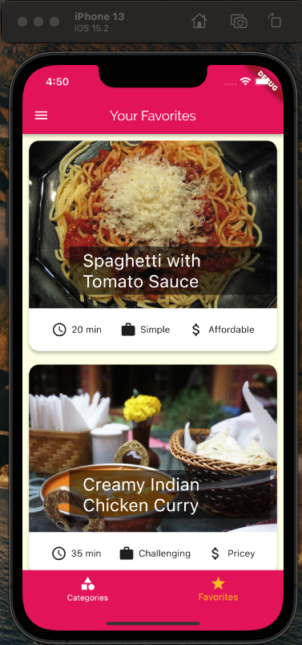
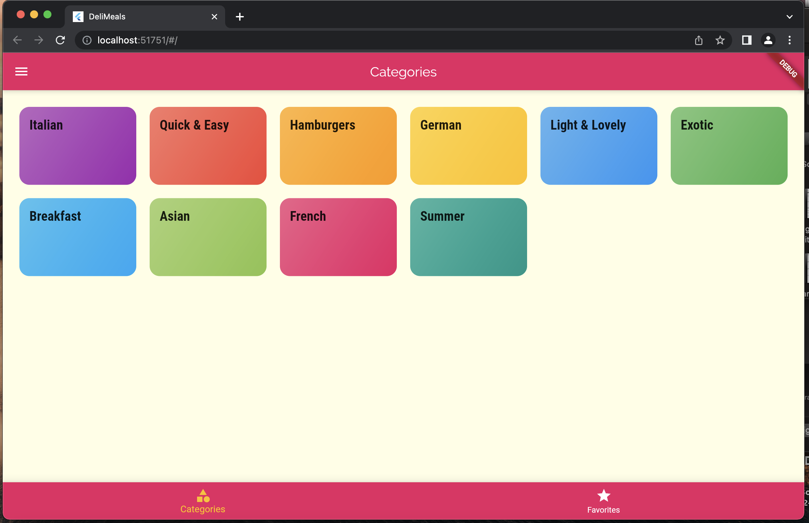

# Flutter-Meals-App

A Flutter recipe app (DeliMeals). Users can browse meals by category, view
ingredients and cooking steps, mark meals as favorites, and filter meals by
dietary criteria (gluten free, lactose free, vegan, vegetarian).

## How to run

The app is pinned to Dart 2 (`sdk: ">=2.1.0 <3.0.0"` in `pubspec.yaml`), so it
needs an older Flutter SDK with Dart 2 and will not build as-is on current
Flutter releases. With a compatible SDK installed:

```
flutter pub get
flutter run
```

The repo includes platform folders for Android, iOS, web, Linux, macOS, and
Windows, so `flutter run -d <device>` works for any of them. All meal data is
hardcoded in `lib/dummy_data.dart`; no backend or API key is needed.

## Screenshots

*Main page*



*Inside a category*



*Meal detail page*



*Drawer*



*Filters page*



*Favorites page*



*Web build*



## Tech used

- Flutter and Dart
- Material Design widgets with named-route navigation
- Custom fonts (Raleway, RobotoCondensed) bundled under `assets/fonts/`
- `cupertino_icons` package; otherwise no third-party dependencies
- State handled with plain `setState` in `lib/main.dart`

## Status

Coursework, 2022.
